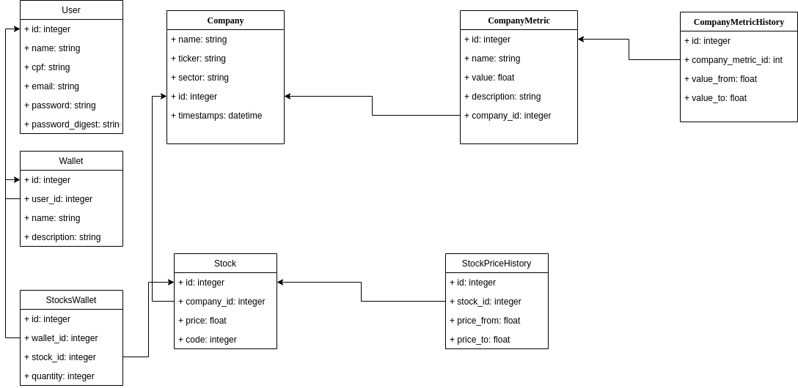

# Comparador de Ativos

Trabalho da disciplina de Programação para dispositivos móveis da Fatec Zona sul, 1º semestre de 2020, Noturno

Aluno: André Lucas Veríssimo de Souza

## Visão geral do sistema

## TODO

- Adicionar o restante das models de acordo com o diagrama
- Adicionar o restante dos DAOs
- Adicionar o restante das controllers
- Adicionar views
- Adicionar lógica de comparar ativos
- Definir o layout das páginas para melhorar a usabilidade

## Issues

- Resolver problema de conexão do glassfish com o banco de dados(a classe
  StockPicker consegue se conectar porém o server não consegue)

